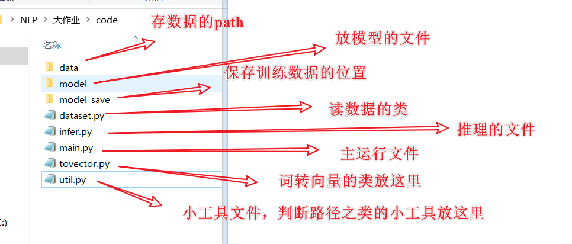

# NLP_task

咱哥仨的大作业

在 `data`  文件夹下，放置 `aclImdb`文件夹

`dataset.py` 已经写完了

|       | 当前任务      |
|:-----:|:---------:|
| Huang | n-gram    |
| lv    | cbow      |
| xiao  | 线性 + LSTM |

建议是model下写模型, 不过格式不重要

各文件介绍(仅建议，不必遵守)：

